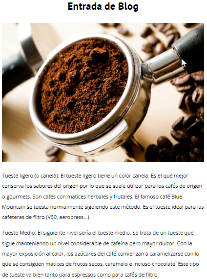

# Blog de Café ☕️

## **Description**

A basic blog of coffee where you can find a lot of info obout it and free courses. This proyect is for show the most basic form in that you can build a web and also, one of my first steps in web development. 🙂

## **Structure**

This blog has differents pages as "Contacto, cursos, entrada, nosotros, index" all of this pages are for give the specific information to the visitor.

- _Index:_

The index page contains the main info like a summary about the other pages, which means here you gonna watch part of cursos page and nuestro blog items where you'll can move into the entrada page.

- _Entrada:_

This is for present some info reffering to the Nuestro Blog part in the Index section, here it's presented more details depending on the item tittle, could be coffee's characteristic, Coffee's Advances, etc. Currently it's presented three items for this section and for each one of this we can have one entrada page.

- _Cursos:_
  In this page you can find some courses about coffee, its prices and the number of tickets that are available for each course. Also contains the description relevant to the coffee as extraction techniques, coffee recipes.

- _Nosotros:_
  This section is for explain why this blog was created, the "members" and give a little image about what can you find in the blog. It's really basic info and as to its complexity is minimum

- _Contacto:_
  the last one of the proyect, this page show a contact form with basic items like name, email and message also the buttom for de submit, it's very basic which menas that the form doesn't have validation in its items.

:blush: If you wanna watch this proyect you can do it <a href="https://randy-urriola.github.io/Blog_cafe/" target="blank">Here</a>
